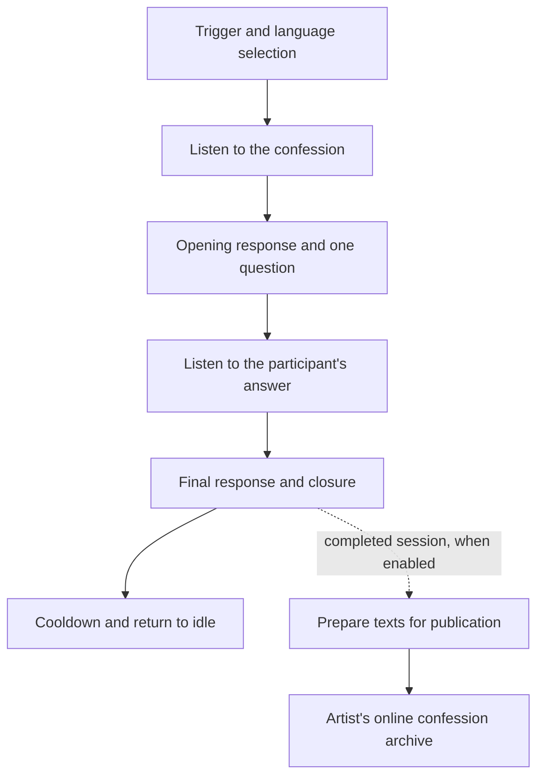

# The Algorithm Creed

**Software for an interactive art installation — a voice ritual shaped by a deliberately bounded conversation.**

Developed by [Davide Gaglione](https://davide.sh) in collaboration with contemporary artist [Matteo Mandelli (YOU)](https://matteomandelli.com), *The Algorithm Creed — Il Confessionale* brings AI into a physical confessional. A participant speaks, the system challenges what it has heard, listens to an answer, and delivers a final response.

The software gives the artwork its rhythm: when to listen, when to speak, when to ask a question, and when to end. Italian and English are supported.

[Artist](https://matteomandelli.com) · [Live confession archive](https://confessions.matteomandelli.com) · [Press coverage](#exhibitions--press)

## Exhibitions & press

The artwork was presented at **AI Week 2026 in Milan** and selected for **the first Premio Berlendis in Venice**, in the exhibition *Restiamo Umani! Utopie e distopie nell'era digitale*. These references document the artwork and its exhibition history; this repository contains the later September 2026 software snapshot prepared for public release.

- **AI Week 2026** — [artist's exhibition history](https://matteomandelli.com/exhibitions) and [TGcom24 coverage](https://www.tgcom24.mediaset.it/tgtech/alla-ai-week-2026-arriva-il--confessionale--laico-dell-intelligenza-artificiale_112329544-202602k.shtml).
- **Premio Berlendis, Venice** — [official exhibition page, Spazio Berlendis](https://www.spazioberlendis.it/berlendis-venice-art-prize-first-edition-stay-human-utopias-and-dystopias-in-the-digital-age/). The [official exhibition text](https://www.spazioberlendis.it/wp-content/uploads/2026/02/Foglio-di-sala-berlendis-ENG.docx-1.pdf) also records an exhibition prize for Matteo Mandelli at Marignana Project.
- **Further coverage** — [MilanoToday: the AI confessional at AI Week](https://www.milanotoday.it/attualita/confessionale-intelligenza-artificiale-ai-weekmatteo-mandelli.html).

## A conversation with a defined beginning and end

The runtime controls the sequence. Separate prompts define the artistic role of each AI turn, while Python decides which phase can run next.



1. **Enter:** a keyboard trigger or automatic cycle starts the experience and selects a language.
2. **Confess:** the microphone captures a bounded segment, then speech recognition produces text.
3. **Question:** the first AI turn identifies a contradiction and asks a question. Its prompt explicitly leaves closure to the next phase.
4. **Answer and close:** the participant gets one response window. The second AI turn receives the earlier exchange and closes the ritual; silence is handled explicitly.
5. **Archive:** a completed session can be sent to the artist's website. Sessions using fallback AI responses are excluded.

The application advances only after speech playback has drained. Timeouts, a kill switch, a cooldown, and process supervision keep the installation ready for the next participant. Phase order is enforced by code; the wording of generated replies remains probabilistic, with a bounded quality-check and retry step.

## Why this stack

| Component | Role in the experience |
| --- | --- |
| **Python orchestration** | Owns session state, phase order, bounded listening windows and shutdown. |
| **Groq** | Generates the opening and closing turns with separate prompts and context. Model names and reasoning settings are configurable. |
| **ElevenLabs** | Speech recognition and voice synthesis connect the physical participant to the AI dialogue. |
| **Vosk** | Optional local speech recognition, including fallback when models are installed. |
| **SpeechRecognition, PyAudio, pygame** | Microphone capture, audio queues and playback. |
| **Edge TTS / Windows speech** | Alternative voice output when the primary synthesis path is unavailable. |
| **Background HTTP publisher** | Prepares and uploads the archive entry without blocking the next session. |
| **PowerShell supervision** | Single-instance guards, heartbeat checks and restart backoff support unattended Windows installations. |

## The artist's archive

The installation connects to **[confessions.matteomandelli.com](https://confessions.matteomandelli.com)**, where the experience continues as an online archive. Each uploaded entry contains the processed initial confession and the final AI response. The intermediate question and participant's second answer are used inside the session, rather than uploaded as a complete transcript.

This repository includes the **installation runtime and publisher client**. The artist's website, PHP backend, database, artwork photographs and hosting configuration are maintained separately and are not included.

The public version starts with publishing **disabled** and no configured destination or credentials. Connecting it to an archive requires an explicitly configured HTTPS endpoint and its ingest token. The live artist site is a reference for the project, not a public write API.

## Run locally

The installation scripts target **Windows**. Dependency installation and offline checks were verified with **Python 3.13**; a microphone, speakers and valid provider credentials are required for a live session.

```powershell
git clone https://github.com/DavideWasTaken/The-Algorithm-Creed.git
cd The-Algorithm-Creed
python -m venv .venv
.\.venv\Scripts\python.exe -m pip install -r requirements.txt

$env:GROQ_API_KEY = "<your-groq-key>"
$env:ELEVENLABS_API_KEY = "<your-elevenlabs-key>"
$env:ALGOCREED_MODE = "once"
.\.venv\Scripts\python.exe main.py
```

Provider calls require network access and may incur charges. For repeated sessions, use `ALGOCREED_MODE=hotkey` (default, **A** starts or interrupts a session) or `auto`. See [the Windows operations guide](GUIDA_AVVIO_WINDOWS.md) for supervision and autostart.

[`.env.example`](.env.example) lists the main settings. It is a reference template: the application reads **environment variables**, and does not automatically load `.env` files. Set values in the process environment or your deployment's environment manager. Configure a voice available to your ElevenLabs account when needed.

To use local recognition, download Italian/English [Vosk models](https://alphacephei.com/vosk/models), set `ALGOCREED_STT_BACKEND=vosk`, and point `ALGOCREED_VOSK_MODEL_IT` / `ALGOCREED_VOSK_MODEL_EN` to the unpacked model directories. This makes transcription local; AI generation and the configured cloud voice services still use the network.

## Publication and data handling

- The public copy contains no deployment credentials, recordings, participant records or original Git history.
- Automatic transcript/reply printing has been removed from the runtime so the watchdog does not routinely copy conversation text into logs.
- Both the confession and final response go through a model-based anonymization step before upload. The legacy `confession` field carries the processed text too; raw transcripts are not sent to the archive by this public client.
- If preparation fails, the entry is dropped rather than published or saved as a raw fallback. Prepared texts are saved atomically in the ignored local `pending_publish.jsonl` before delivery and removed after acknowledgement. Pending prepared entries survive shutdown and retry at the next publisher startup without another AI rewrite. An uncertain delivery or interrupted acknowledgement can produce duplicates; the endpoint does not provide idempotency.
- Anonymization by an AI model is **not a guarantee**. Prepared texts and the retry file may still contain identifying details. Operators need participant consent, appropriate access controls and retention, and review/moderation suited to the installation.
- Audio/text are sent to the configured cloud providers during recognition, generation and voice synthesis. Original publication texts also go to Groq for anonymization. No microphone recordings are bundled in this release.

These are the behaviors of this public client. They do not describe or change the retention policy or deployment of the artist's separately hosted website.

## Checks

The offline suite uses synthetic conversations and substituted provider/HTTP boundaries; it does not record audio or contact the artist's website.

```powershell
python -m unittest discover -s tests -v
python -m compileall -q main.py publisher.py
```

CI runs the offline tests on Windows and Linux. Hardware behavior, voice quality, provider model availability and an end-to-end live installation still require deployment testing.

## Credits

**Artistic concept and direction:** [Matteo Mandelli (YOU)](https://matteomandelli.com).
**Software architecture and implementation:** [Davide Gaglione](https://davide.sh), developed in collaboration with the artist.

The artwork, title and artistic identity remain attributed to Matteo Mandelli. This public source release does not grant rights to reproduce the installation, its imagery or its artistic identity. No open-source license is granted by this repository at this time.
